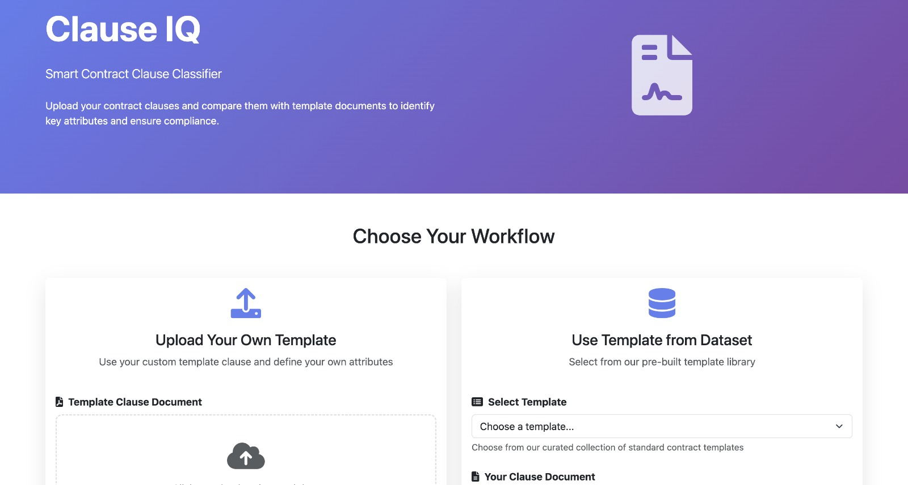
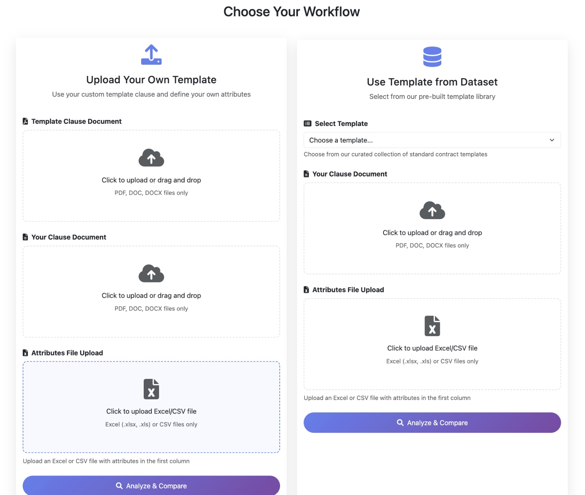
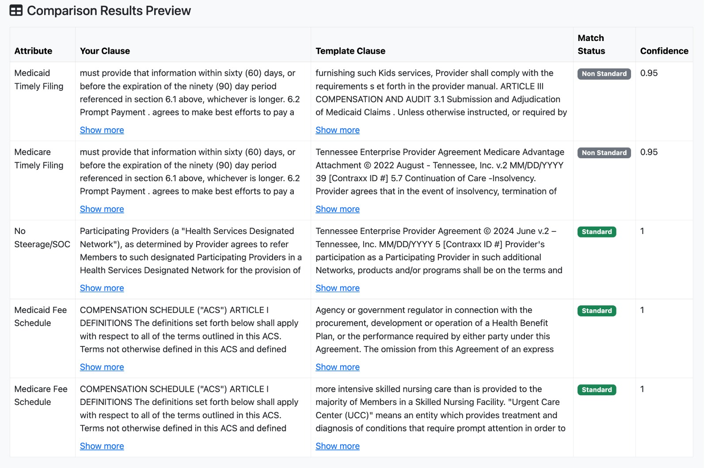

# HiLabs Hackathon 2025: Smart Contract Language Tagging for Negotiation Assist


---

## 📌 Approach
### Step 1 — Semantic Search & Clause Retrieval
- **Document Processing:** PDF/DOC/DOCX files are chunked using `RecursiveCharacterTextSplitter`
- **Embedding Generation:** Uses `nomic-ai/nomic-embed-text-v1` sentence transformers to create vector representations
- **Similarity Matching:** Cosine similarity between attribute queries and document chunks to find most relevant clauses
- **Clause Extraction:** Retrieves the best matching template clause and candidate clause for comparison

### Step 2 — Standard vs Non-Standard Classification
**Model:** Fine-tuned `Qwen/Qwen3-1.7B` with Contrastive Learning  
_Qwen3-1.7B + LoRA (no QLoRA) + SFT + Triplet + InfoNCE_

- **Backbone:** `AruniAnkur/aiquest_custom_qwen_1.7B` (Hugging Face Transformers)
- **PEFT:** LoRA adapters on attention + MLP projections
- **Hybrid Objective:**
  - **SFT CE** — model outputs exactly `Standard` or `Non-Standard`
  - **Triplet margin** — local margin per Anchor clause
  - **InfoNCE + memory queue** — global separation with many negatives
- **Input Format:** Attribute + Template Clause + Candidate Clause
- **Output:** JSON classification with confidence score

## Project Structure

```
Clause_IQ/
├── app.py                          # Main Flask application
├── helper.py                       # AI model helper functions
├── prompts.py                      # System prompts for AI classification
├── requirements.txt                # Python dependencies
├── Dockerfile                      # Docker image configuration
├── docker-compose.yml              # Docker orchestration
├── .dockerignore                   # Docker build exclusions
├── start-docker.sh                 # Quick start script (Mac/Linux)
├── start-docker.bat                # Quick start script (Windows)
├── DOCKER-README.md                # Comprehensive Docker guide
├── DOCKER-SETUP-SUMMARY.md         # Quick Docker reference
├── templates/
│   └── index.html                  # Web interface template
├── standard_tempate_default/       # Pre-built template documents
│   ├── TN_Standard_Template_Redacted.pdf
│   └── WA_Standard_Redacted.pdf
├── training_code/                  # Model training scripts
└── uploads/                        # Temporary file storage (created automatically)
```

# Setup Instructions

1. **Clone the repository:**
```bash
git clone https://github.com/aruniankur/Clause_IQ.git
cd Clause_IQ
```

2. **Create a virtual environment:**
```bash
python -m venv venv
```

3. **Activate the virtual environment:**

On Windows:
```bash
venv\Scripts\activate
```

On macOS/Linux:
```bash
source venv/bin/activate
```

4. **Install required dependencies:**
```bash
pip install -r requirements.txt
```

---

## 🐳 Docker Deployment (Recommended)

**Deploy with Docker for consistent, cross-platform deployment on Mac, Windows, and Linux.**

### Prerequisites
- Docker Desktop (Mac/Windows) or Docker Engine (Linux)
- Docker Compose v2.0 or higher
- At least 8GB of available RAM
- 10GB of free disk space

### Quick Start

#### Option 1: Using Startup Scripts (Easiest)

**Mac/Linux:**
```bash
chmod +x start-docker.sh
./start-docker.sh
```

**Windows:**
```cmd
start-docker.bat
```

#### Option 2: Using Makefile (Recommended)

```bash
# First time setup
make init

# Start application
make up

# View logs
make logs

# Stop application
make down

# See all commands
make help
```

#### Option 3: Using Docker Compose

```bash
# Build and start the application
docker-compose up -d

# View logs
docker-compose logs -f

# Stop the application
docker-compose down
```

### Access the Application

Once running, open your browser and navigate to:
```
http://localhost:5000
```

### Docker Configuration

Create a `.env` file for environment variables:
```bash
cp .env.example .env
# Edit .env with your API keys and configuration
```

### Common Docker Commands

```bash
# View running containers
docker-compose ps

# Rebuild after code changes
docker-compose up -d --build

# View resource usage
docker stats clause_iq_app

# Execute commands inside container
docker-compose exec clause_iq bash

# Clean up everything
docker-compose down -v
```

### Platform-Specific Notes

**Mac (Apple Silicon):** Works automatically with ARM64 architecture

**Windows:** Ensure Docker Desktop is running and WSL2 integration is enabled

**Linux:** Add your user to docker group:
```bash
sudo usermod -aG docker $USER
newgrp docker
```

For detailed Docker documentation, troubleshooting, and production deployment guides, see:
- **Quick Reference:** `DOCKER-SETUP-SUMMARY.md`
- **Full Guide:** `DOCKER-README.md`

---

## Usage

### Starting the Application

1. **Ensure your virtual environment is activated:**
```bash
# Windows
venv\Scripts\activate

# macOS/Linux
source venv/bin/activate
```

2. **Run the Flask application:**
```bash
python app.py
```

3. **Open your web browser and navigate to:**
```
http://localhost:5000
```

### Using the Web Interface

#### Workflow 1: Upload Your Own Template
1. Upload your template document (PDF, DOC, DOCX)
2. Upload your contract document for comparison
3. Upload an attributes file (Excel/CSV) with attributes in the first column
4. Click "Analyze & Compare"

#### Workflow 2: Use Template from Dataset
1. Select a pre-built template (TN or WA Standard)
2. Upload your contract document for comparison
3. Upload an attributes file (Excel/CSV) with attributes in the first column
4. Click "Analyze & Compare"



### Example Output 




# Fine-Tuning Strategy of Qwen 1.7B

## Dataset Generation

A sophisticated data generation pipeline using Google's Gemini API to create a high-quality, contrastive dataset for fine-tuning language models on legal clause classification.

🎯 The Challenge: Teaching AI to Understand Legal Nuance

In legal and contractual documents, the difference between a compliant ("standard") clause and a non-compliant ("non-standard") one can be subtle but critical. A single ambiguous word can change the entire meaning of a contract.

Fine-tuning a general-purpose Large Language Model (LLM) like Qwen-1.7B for this task requires a very specific type of dataset: one that teaches the model to differentiate between clauses that are semantically similar but legally distinct.
💡 Our Solution: A Multi-Phase Augmentation Strategy

We employ a powerful, multi-phase strategy that combines human-in-the-loop curation with advanced LLM-powered data augmentation to build a rich, contrastive dataset.

Phase 1: Human-in-the-Loop - Foundational Data Curation

We use the powerful search and generation capabilities of the Gemini for :

    Keyword-driven Search: Identify relevant contractual documents.

    Manual Verification

Phase 2: Defining the "Gold Standard" - Anchor Paragraphs

For each state, we establish a "gold standard" or anchor file (e.g., Standard_WA.xlsx). This file contains the ideal, perfectly compliant version of a clause for each key attribute (e.g., "Medicaid Timely Filing"). This anchor serves as the ground truth for our contrastive learning task.

Phase 3: Contrastive Augmentation

This is where the automated magic happens. Our Python script orchestrates a sophisticated data generation workflow:

    Load Anchor & Real-World Data: The script loads the "gold standard" anchor file and the set of curated real-world example files (WA_1.xlsx, TN_1.xlsx, etc.).

    Generate Contrastive Pairs: For each clause in the real-world files, the script prompts the Gemini API to generate two distinct sets of new clauses:

        ✅ Positive Pairs (Standard): It generates variations of the clause that are rephrased but remain fully compliant, adhering to our strict "standard" rules (e.g., maintaining specific timeframes, using assertive language).

        ❌ Negative Pairs (Non-Standard): It generates variations that are deliberately corrupted to be non-compliant. This is achieved by introducing ambiguity, using vague timeframes ("promptly" instead of "90 days"), or weakening the language ("payment may be denied" instead of "payment will be denied").

This process creates a rich dataset where for every concept, the model sees both correct and subtly incorrect examples, forcing it to learn the precise rules of legal compliance.

## Standard vs Non-Standard Clause Classifier
_Qwen3-1.7B + LoRA (no QLoRA) + SFT + Triplet + InfoNCE_

Fine-tune a decoder LLM (**Qwen/Qwen3-1.7B**) to label a **Candidate** clause as **`Standard`** or **`Non-Standard`**, given an **Attribute** and an **Anchor (Standard)** clause.  
We combine **instruction tuning** (SFT) with **contrastive learning** (Triplet + InfoNCE) to get both instruction following and robust discrimination.

---

### ✨ Highlights

- **Backbone:** `Qwen/Qwen3-1.7B` (Hugging Face Transformers)
- **PEFT:** LoRA adapters on **attention + MLP** projections (no QLoRA)
- **Hybrid objective:**
  - **SFT CE** — model outputs exactly `Standard` or `Non-Standard`
  - **Triplet margin** — local margin per Anchor
  - **InfoNCE + memory queue** — global separation with many negatives
- **Leakage-safe split:** by **Anchor** (unseen anchors in eval)
- **Memory-friendly:** single-GPU training via small batches + grad accumulation

---


### 📊 Data Format

Input CSV columns (names are normalized in code):

| Attribute | Anchor Element | GeneratedClause / Candidate Clause | Label |
|---|---|---|---|
| Methodology | <standard anchor text> | <candidate clause> | Standard / Non-Standard |

**Notes**
- `Label` is normalized to **`Standard`** or **`Non-Standard`**.
- We form **triplets per Anchor**: `(Anchor, Positive=Standard variant, Negative=Non-Standard variant)`.
- We split **by Anchor** to avoid lexical leakage into eval.

---

### 🧠 Learning Objective

#### 1) SFT (Supervised Fine-Tuning)
Short chat prompt ending with `Label:`; supervise **only** the label suffix tokens:


#### 2) Triplet Margin Loss
Mean-pool hidden states to get embeddings \(E_a, E_p, E_n\) for **Anchor**, **Positive**, **Negative**:

$$
\mathcal{L}_{\text{triplet}}
=\max\!\left(0,\; m - \cos(\mathbf{E}_a,\mathbf{E}_p) + \cos(\mathbf{E}_a,\mathbf{E}_n)\right)
$$

#### 3) InfoNCE (with queue)
Anchor as query $q$, Positive as key $p$, and a queue $\mathcal{N}$ of negatives:

$$
\mathcal{L}_{\mathrm{nce}}
= -\log \frac{\exp\left( \frac{q\cdot p}{\tau} \right)}
{\exp\left( \frac{q\cdot p}{\tau} \right) + \sum_{n \in \mathcal{N}} \exp\left( \frac{q\cdot n}{\tau} \right)}
$$

#### 4) Total Objective

$$\mathcal{L}=\mathcal{L}_{\mathrm{sft}}+\lambda_{\mathrm{triplet}}\mathcal{L}_{\mathrm{triplet}}+\lambda_{\mathrm{nce}}\mathcal{L}_{\mathrm{nce}}$$

---

### ✅ Why This Approach Works (Justification)

Our pipeline is built to mirror how legal analysts actually work: **retrieve** the most relevant clause, then **judge** whether a candidate adheres to the standard. Step-1’s semantic search reduces hallucination risk by grounding the model in the *right* text spans, while Step-2’s fine-tuned `Qwen3-1.7B` learns the **decision boundary** between “wording that preserves the same legal intent” and “carve-outs/conditions that change obligations.” We fine-tune with **LoRA** (attention + MLP) to adapt semantics cost-effectively without touching the full 1.7B weights; this keeps training fast, reproducible, and deployable on a single GPU. Crucially, we don’t rely on SFT alone: we add **Triplet** (local margin around each Anchor) and **InfoNCE with a memory queue** (global separation against many hard negatives). This contrastive signal forces the model to distinguish **near-miss** phrasing (“95% of fee schedule”) from **true structural changes** (exceptions, alternate methodologies), which is exactly where human negotiators spend time. The result is a classifier that is (1) **accurate** on subtle legal nuances, (2) **robust** to paraphrase and templated variation, (3) **scalable** across states/templates by swapping anchors, and (4) **operationally efficient** thanks to LoRA, making it a practical fit for real-world negotiation assist.


## 🐍 Environment

```bash
# Python 3.10–3.12
pip install "transformers>=5.0.0" peft datasets accelerate pandas scikit-learn torch --upgrade

# Optional (prettier progress bars in notebooks)
pip install ipywidgets


## 🚀 Training

```bash
# 1) (Optional) Create & activate a venv
python -m venv .venv
# Windows:
.venv\Scripts\activate
# macOS/Linux:
# source .venv/bin/activate

# 2) Install deps
pip install "transformers>=5.0.0" peft datasets accelerate pandas scikit-learn torch --upgrade

# 3) Make sure your data is here:
# training_dataset/training_dataset.csv

# 4) Launch training
python train_qwen3_lora_sft_triplet_infonce.py
